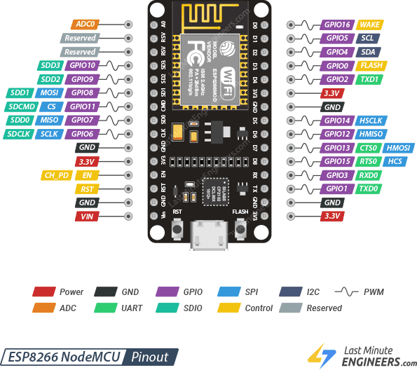

# narodmon.ru-8266-v1 #
___

## Спецификация ##
- Отладочная плата NodeMCU на базе ESP8266.
- Датчик температуры и влажнсти DHT22.
- Датчик температуры DS18B20.
- Датчик атмосферного давления BMP180.
___

## FLProg ##
Версия FLProg: 8.0.2
___ 
## ESP8266 NodeMCU ##
### pinout ###

### Питание NodeMCU ###
Входы GND и VIN: от 5 до 10 Вольт.
Входы GND и 3V3: 3.3 Вольт.1
___